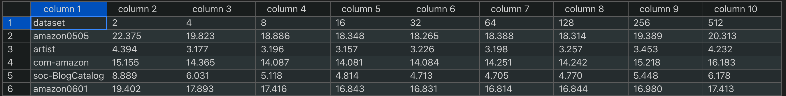
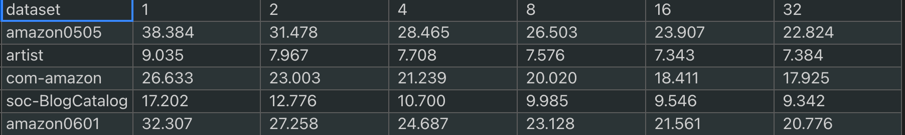
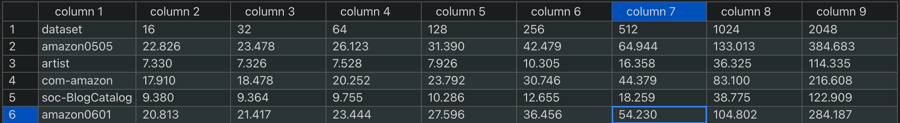
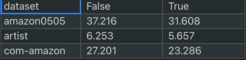

# GNNAdvisor: An Efficient Runtime System for GNN Acceleration on GPUs
+ [**[Paper, Slides, Video Talk] at USENIX OSDI'21**](https://www.usenix.org/conference/osdi21/presentation/wang-yuke)
```
@inproceedings{GNNAdvisor,
  title={GNNAdvisor: An Efficient Runtime System for GNN Acceleration on GPUs},
  author={Yuke Wang and Boyuan Feng and Gushu Li and Shuangchen Li and Lei Deng and Yuan Xie and Yufei Ding},
  booktitle={USENIX Symposium on Operating Systems Design and Implementation (OSDI'21)},
  year={2021}
}
```
## 1. Getting Started Instructions.
+ **Clone this project**
```
git clone --recursive git@github.com:YukeWang96/OSDI21_AE.git
```

+ **Hardware**: 
> + `CPU x86_64` with host memory >= 32GB. (Tested on Intel Xeon Silver 4110 (8-core 16-thread)  CPU  with 64GB host memory).
> + `NVIDIA GPU (arch>=sm_60)` with devcie memory >= 16GB. (Support NVIDIA [**Quadro P6000**](https://www.nvidia.com/content/dam/en-zz/Solutions/design-visualization/productspage/quadro/quadro-desktop/quadro-pascal-p6000-data-sheet-a4-nv-704590-r1.pdf) (`sm_61`), [**Tesla V100**](https://images.nvidia.com/content/technologies/volta/pdf/437317-Volta-V100-DS-NV-US-WEB.pdf) (`sm_70`), and [**RTX3090**](https://www.techpowerup.com/gpu-specs/geforce-rtx-3090.c3622) (`sm_86`). Note that upon creating this artifact, we mainly evaluate our design on **RTX3090**. The execution time may be different across different devices but the overall trend of performance (speedup) is similar.

+ **OS & Compiler**: 
> + `Ubuntu 16.04+`
> + `gcc >= 7.5`
> + `cmake >= 3.14`
> + `CUDA >= 11.0` and `nvcc >= 11.0`

+ **Important Files/Directories**
> + `dgl_baseline/`: contains latest DGL implementation and python benchmark and result analysis scripts. 
> + `pyg_baseline/`: contains latest PyG implementation and python benchmark and result analysis scripts. 
> + `Gunrock/`: contains latest Gunrock implementation of SpMM kernel for neighbor aggregation and python benchmark script. 
> + `Docker/`: contains docker file for setting up the compilation and running environment.
>> + `cu102/`: dockerfile for sm < 80, such as Quadro P6000 and Tesla V100.
>> + `cu110/`: dockerfile for sm >= 80, such as RTX 3090.
> + `rabbit_module/`: contains the source of rabbit reordering and python binding.
> + `GNNAdvisor/`: the directory for GNNAdvisor and Python benchmark and result analysis scripts. 
>> + `GNNConv/`: the C++/CUDA source code (`GNNAdvisor_kernel.cu`) for GNN sparse computation kernel, python binding of kernels (`GNNAdvisor.cpp`) and python `setup.py` installation script.
>> + `gnn_conv.py`: the Python script for defining the GNN convolution at high-level.
>> + `param.py`: the Python script for defining the input-level properties and different rules for handling this properties to generate performance-related configuration, such as `warpPerBlock`.
>> + `dataset.py`: the Python loader for datasets from either plain `.txt` edgeList files or binary `.npy` file.
>> + `./s7-4_1_neighbor_partitioning.py`, `./s7-4_2_dimension_partitiong.py`, `./s7-4_3_node_renumbering.py` and `./s7-5_1_hidden_dimension.py` are for running additional studies in our paper.
> + `unitest.py`: the Python script for verifying our basic sparse kernel.
> + `osdi-ae-graphs/` containts the `.npy` files for all three Types of datasets.
> + `osdi-ae-graphs-mtx/` containts the plain `.mtx` files for the Type III datasets for Gunrock SpMM kernel evaluation. 


### **Step-1: Environment Setup** 
There are two ways to setup the environment of GNNAdvisor and baselines.
### + **Method 1**:  Setup the environment via Docker (**Recommended**).
+ Install Docker Engine with NVIDIA GPU Support **[Toturial](https://docs.nvidia.com/datacenter/cloud-native/container-toolkit/install-guide.html#docker)**. We use the following commands
```
curl https://get.docker.com | sh \
  && sudo systemctl --now enable docker

distribution=$(. /etc/os-release;echo $ID$VERSION_ID) \
   && curl -s -L https://nvidia.github.io/nvidia-docker/gpgkey | sudo apt-key add - \
   && curl -s -L https://nvidia.github.io/nvidia-docker/$distribution/nvidia-docker.list | sudo tee /etc/apt/sources.list.d/nvidia-docker.list

sudo apt-get update
sudo apt-get install -y nvidia-docker2
sudo systemctl restart docker
```
+ `cd Docker` then either goto `cu102/` (for Quadro P6000 and Tesla V100) or `cu110/` (for RTX3090).
+ Run `./build.sh`, it may takes a while (around 10 minutes) for building the container.
+ Run `./launch.sh` then it will bring up an new interactive command line interface.
> + if your enounter problem below,
```
docker: Error response from daemon: could not select device driver "" with capabilities: [[gpu]].
```
then you need to 
```
sudo apt-get update && sudo apt-get install -y nvidia-container-toolkit
sudo systemctl restart docker
```

> + The defualt GPU is device:0. If you want to run on different deivce. Consider using this command in `./launch.sh`, e.g., using device:1
>  
```
docker run -it --rm --gpus device=1 -v $PWD/../../:/GNNA osdi-ae:latest /bin/bash
```
+ Run `./install_pkg.sh` to install the GNNAdvisor and rabbit_module. **Note: Select the correct sm version before install the package.
> + `install_pkg_sm86.py` for RTX3090.
> + `install_pkg_sm70.py` for Tesla V100.
> + `install_pkg_sm61.py` for Quadro P6000.

+ To clean the building packages when exit docker, run `./clean_build.sh`, root access premission may required.  

### + **Method 2**: Setup via conda and pip
#### 1) Install system packages for compiling rabbit reordering (root user required). 
+ **`libboost`**: `sudo apt-get install libboost-all-dev`.
+ **`tcmalloc`**: `sudo apt-get install libgoogle-perftools-dev`.
+ **`cmake`**: `sudo apt-get update && sudo apt-get -y install cmake protobuf-compiler`.


#### 2) Install Pytorch environment.
+ Install **`conda`** on system **[Toturial](https://www.digitalocean.com/community/tutorials/how-to-install-anaconda-on-ubuntu-18-04-quickstart)**.
+ Create a **`conda`** environment: 
```
conda create -n env_name python=3.6
```
+ Install **`Pytorch`**: 
```
conda install pytorch torchvision torchaudio cudatoolkit=11.1 -c pytorch -c conda-forge
```
or using `pip` [**Note that make sure the `pip` you use is the `pip` from current conda environment. You can check this by `which pip`**]
```
pip install torch==1.8.0+cu111 torchvision==0.9.0+cu111 torchaudio==0.8.0 -f https://download.pytorch.org/whl/torch_stable.html
pip install tqdm
pip install scipy
```
+ Install [**`Deep Graph Library (DGL)`**](https://github.com/dmlc/dgl).
```
conda install -c dglteam dgl-cuda11.0
pip install torch requests
```

+ Install [**`Pytorch-Geometric (PyG)`**](https://github.com/rusty1s/pytorch_geometric).
```
pip install torch-scatter -f https://pytorch-geometric.com/whl/torch-1.8.0+cu111.html
pip install torch-sparse -f https://pytorch-geometric.com/whl/torch-1.8.0+cu111.html
pip install torch-cluster -f https://pytorch-geometric.com/whl/torch-1.8.0+cu111.html
pip install torch-spline-conv -f https://pytorch-geometric.com/whl/torch-1.8.0+cu111.html
pip install torch-geometric
```

+ Install GNNAdvisor Pytorch Binding.
> + Go to `GNNAdvisor/GNNConv`, then `python setup.py install` to install the GNNAdvisor modules.
> + Go to `rabbit_module/src`, then `python setup.py install` to install the rabbit reordering modules.

### **Step-2: Download the graph datasets.**
+ Our preprocessed graph datasets in `.npy` format can be downloaded via this **[[LINK](https://drive.google.com/file/d/12lPJi9eV9hbiy5Q3Fs1luEhkkvA0Yyk5/view?usp=sharing)]** or you can use the following command (filename: `osdi-ae-graphs.tar.gz`).
```
wget https://storage.googleapis.com/graph_dataset/osdi-ae-graphs.tar.gz
```
+ Unzip the graph datasets `tar -zxvf osdi-ae-graphs.tar.gz` at the project root directory.
+ Note that node inital embeeding is not included, and we generate an all 1s embeeding matrix according to users `input dimension` parameter at the runtime for just performance evaluation.

## 3. Detailed Instructions.

+ **GNN Model Setting**.
> + **GCN (2-layer with 16 hidden dimension)**
> + **GIN (5-layer with 64 hidden dimension)**
+ **Datasets**.
> + **Type I**:
> `citeseer, cora, pubmed, ppi`
> + **Type II**:
> `PROTEINS_full, OVCAR-8H, Yeast, DD, TWITTER-Real-Graph-Partial, SW-620H`
> + **Type III**:
>`amazon0505, artist, com-amazon, soc-BlogCatalog, amazon0601`

+ **Running **DGL** baseline on GNN training (Figure 9)**.
> +  Go to **`dgl_baseline/`** directory
> + **`/0_run_gcn.sh` and `./0_run_gin.sh` to run DGL and generate `.csv` result for GCN and GIN, respectively**. Or you can run seperate commands,
>> + `./0_bench_dgl_gcn.py| tee run_dgl_gcn.log` to run the script and the report 200 epoch runtime for all evaluated datasets. 
>> + `./1_log2csv.py` to convert the `run_dgl_gcn.log` to `run_dgl_gcn.csv` for ease of visualization.

+ **Running **PyG** baseline on GNN training (Figure 10)**.
> +  Go to **`pyg_baseline/`** directory;
> + **`/0_run_gcn.sh` and `./0_run_gin.sh` to run PyG and generate `.csv` result for GCN and GIN, respectively**. Or you can run seperate commands,
>> + `./0_bench_pyg_gcn.py| tee run_pyg_gcn.log` to run the script and the report 200 epoch runtime for all evaluated datasets. 
>> + `./1_log2csv.py run_pyg_gcn.log` to convert log result to  `run_pyg_gcn.csv` for ease of analysis.

+ **Running **Gunrock** for single SpMM (neighbor aggregation) kernel**.
> + We measure the single SpMM kernel performance with Gunrock (Note that based on most reviewers' feedback directly end-to-end inference comparison with Gunrock on sampled GraphSAGE model is not fair, therfore, we decide to compare our single SpMM kernel with Gunrock SpMM kernel).
> + Go to `Gunrock/` directory. In case you forget to use `--recursive` when call `git clone` at the beginning, you need to call `git submodule init && git submodule update` to pull `Gunrock` repo.
> + Download the `.mtx` dataset of Type III graphs for Gunrock from this **[[LINK](https://drive.google.com/file/d/174tuObwEqm-rcV3Y7uL1JkJNrHFblLj9/view?usp=sharing)]**, then uncompress the `.tar.gz` file using `tar -zxvf osdi-ae-graphs-mtx.tar.gz`.
> + Under `Gunrock/` call `./build_spmm.sh` to build the Gunrock spmm kernel. (it may take for a while for complete).
> + **`./0_bench_Gunrock.py` for profile `spmm`**. The instruction to run single neighbor aggregation kernel for GNNAdvisor can be found below by specifying an command line option.
> + **Note that Running Gunrock experiments does not require the Docker environment, and it require the system has CMake >= 3.14, and CMake==3.20.0 is recommended.**

+ **Running GNNAdvisor (Figure 9 and Figure 10)**.
> +  Go to **`GNNAdvisor/`** directory. 
> + **`./0_run_gcn.sh` and `./0_run_gin.sh` to run GNNAdvisor and generate `.csv` result for GCN and GIN, respectively**. Or you can run seperate command with different configurations as 
>>  + `./0_bench_GNNA_GCN.py| tee run_GNNA_GCN.log` to run the script and the report 200 epoch runtime for all evaluated datasets. Note that there are also several options (such as enable_rabbit) for configuring a profiling.
>>  + `./1_log2csv.py` to convert the `run_GNNA_GCN.log` to `run_GNNA_GCN.csv` for ease of result analysis.
> + **`./3_single_spmm_bench.py` to profile a single SpMM kernel to compare with Gunrock SpMM kernel discussed above**.
> +  Stand alone running with specified parameters.
>> + `--dataset`: the name of the dataset.
>> + `--dim`: the size of input embedding dimension, default: 96.
>> + `--hidden`: the size of hidden dimension, default: 16.
>> + `--classes`: the number of output classes, default: 22.
>> + `--partSize`: the size of neighbor-group, default: 32. 
>> + `--dimWorker`: the number of worker threads (**<=32**), default: 32.
>> + `--warpPerBlock`: the number of warp per block, default: 8, recommended: GCN: (8), GIN: (2 for citeseer, 8 for remaining datasets).
>> + `--sharedMem`: the shared memory size for each Stream-Multiprocessor on NVIDIA GPUs. A reference for different GPU architecture and its shared memory size can be found at [here](https://en.wikipedia.org/wiki/CUDA), default 96KB for RTX3090.
>> + `--model`: `gcn` or `gin`. The evaluated example GCN model has 2 layers with 16 hidden dimensions, while the example GIN model has 5 layers with 64 hidden dimensions.
>> + `--num_epoches`: the number of epoches for training, default: 200.
>> + `--loadFromTxt`: If this flag is `True`, it will load the graph TXT edge list, where each line is an `s1 d1`. default: `False` (load from `.npz` which is fast).
>> + `--enable_rabbit`: If this flag is `True`, it will be possible to use the rabbit-reordering routine. Otherwise, it will skip rabbit reordering for both **auto** and **manual** mode.
>> + `--manual_mode`: If this flag is `True`, it will use the value from the parameter `partSize`, `dimWorker` and `dimWorker`. Otherwise, it will determine these three performance-related parameters automatically by `Decider`. **Note that `Decider` will generate two different sets of parameters for input and hidden layers based on a GNN model and the dataset input characters.** In manual mode the value of `partSize`, `dimWorker` and `dimWorker` will be applied to both input and hidden layer.
>> + `--verbose_mode`: If this flag is `True`, it will print out all the details of configuration for running the experiments.
>> + `--single_spmm`: If this flag is `True`, it will only profile a single spmm for 200 rounds. with the provided `--dim` as the `D` in `NxNxD`, where `N` is the number of nodes in a graph.  Run **`./3_single_spmm_bench.py` for profiling single neighbor aggregation (SpMM) kernel in comparison with Gunrock SpMM**.
>> + `--verify_spmm`: If this flag is `True`, it will check the correctness of our SpMM kernel against the CPU reference result. Run `./4_verifying.py` for verifying our major kernel (neighbor aggregation) correctness against CPU reference result from `torch_sparse.spmm`.

**Note**
> + Accuracy evaluation are omitted for all implementations and each sparse kernels are tested via the `unitest.py`
> + We focus on the training evaluation of the GNNs, and the reported time per epoch only includes the GNN model forward and backward computation, excluding the data loading and some preprocessing. 
> + **Since the paper draft submission and the creation of this artifact, DGL has update several of its kernel library (from v0.52 to v0.60). In this comparion we focus on the latest DGL version (v0.60).** 
>> + **Based on our profiling on RTX3090 and Quadro P6000, our design would show minor speedup on the simple GCN model (2-layer and 16 hidden dimension), but show more evident speedup on more complicated GIN model (5-layer and 64 hidden dimension), which can still demonstrate the effectiveness of our optimizations**.
>> + **Our observation is that on small Type I graphs, our frameworks achieve significant speedup for both GCN and GIN model on RTX3090 and Quadro P6000. On larger Type II and Type III datasets, our GIN model implementation would show more evident speedups**.  

+ **Running GNNAdvisor-related Studies (Figure 11(a,b,c) and Figure 12(a))**
> + **`./s7-4_1_neighbor_partitioning.py`(**Figure 11a**) for neighbor partitioning study in Section 7.4**.
> + **`./s7-4_2_dimension_partitiong.py` (**Figure 11b**) for dimension partitioning study in Section 7.4**.
> + **`./s7-4_3_node_renumbering.py` (**Figure 11c**) for node renumbering study in Section 7.4**.
> + **`./s7-5_1_hidden_dimension.py` (**Figure 12a**) for hidden dimension study in Section 7.5**.
> + (**Recommended**) You can run all studies by simply running `./2_run_study.sh`, it will first output all runtime collected information (e.g., average training epoch time) as a `*.log` file, then it will automically call `./2_study2csv.py` to generate the corresponding `*.csv` for ease of analysis. You expected to get several `.csv` files looks like these (open with the [Edit CSV](https://marketplace.visualstudio.com/items?itemName=janisdd.vscode-edit-csv) plugin for vscode)
>> + For `neighbor_partitioning`.

>> + For `dimension_partitiong`.

>> + For `hidden_dimension`.

>> + For `node_renumbering`.<br/>



# Reference
+ [**Deep Graph Library**](https://github.com/dmlc/dgl) <br>
Wang, Minjie, et al. 
**Deep graph library: A graph-centric, highly-performant package for graph neural networks.**. *The International Conference on Learning Representations (ICLR), 2019.*
+ [**Pytorch Geometric**](https://github.com/rusty1s/pytorch_geometric) <br>
Fey, Matthias, and Jan Eric Lenssen. 
**Fast graph representation learning with PyTorch Geometric.** 
*The International Conference on Learning Representations (ICLR), 2019.*
+ [**Gunrock**](https://github.com/gunrock/gunrock) <br>
Wang, Yangzihao, et al. **Gunrock: A high-performance graph processing library on the GPU.** 
*Proceedings of the 21st ACM SIGPLAN Symposium on Principles and Practice of Parallel Programming (PPoPP), 2016.*
+ [**Rabbit Order**](https://github.com/araij/rabbit_order) <br>
J. Arai, H. Shiokawa, T. Yamamuro, M. Onizuka, and S. Iwamura. 
**Rabbit Order: Just-in-time Parallel Reordering for Fast Graph Analysis.** 
*IEEE International Parallel and Distributed Processing Symposium (IPDPS), 2016.*
+ [**GE-SpMM**](https://github.com/hgyhungry/ge-spmm). Guyue Huang, Guohao Dai, Yu Wang and Huazhong Yang. <br>
**GE-SpMM: General-purposed Sparse Matrix-Matrix Multiplication on GPUs for Graph Neural Networks**
*The International Conference for High Performance Computing, Networking, Storage and Analysis, 2020*.
